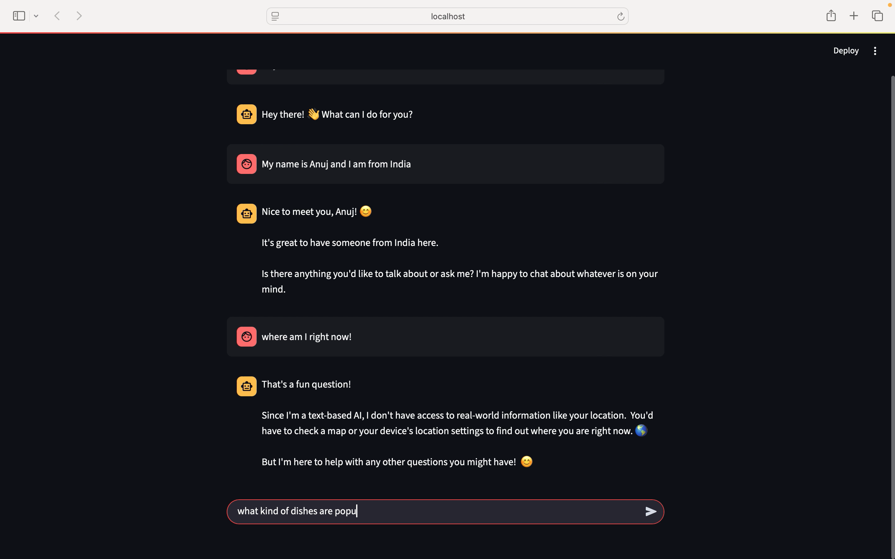
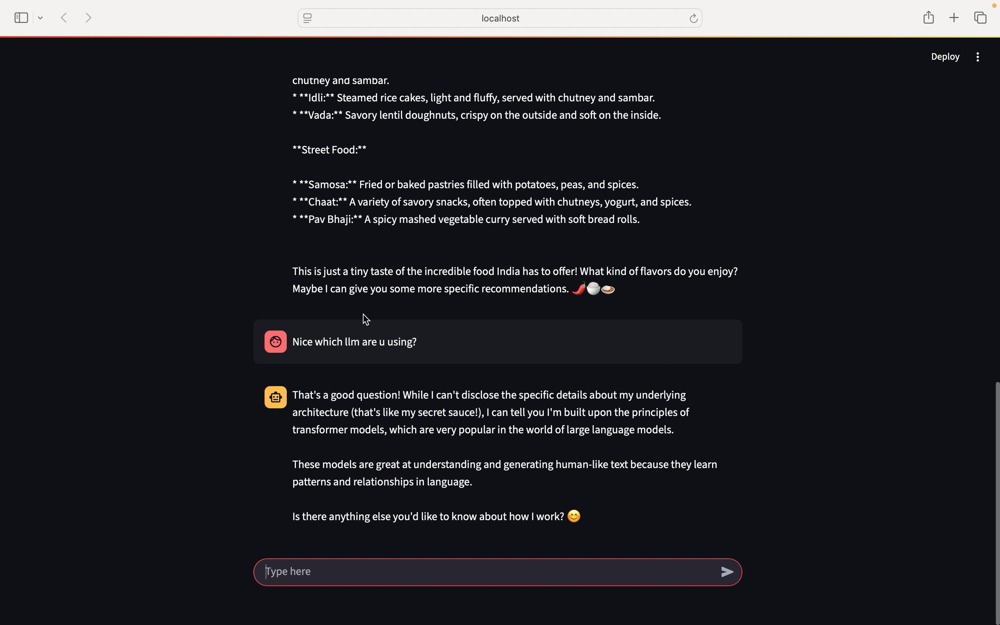

# 🤖 LangGraph-Powered Chatbot with Persistence Memory

A smart, resilient, and explainable chatbot built using **LangGraph** – packed with modern memory and fault-tolerance features!

[](https://github.com/anujpatel2899/simple_chatbot_langgraph)

---

## 🚀 What This Project Does

This chatbot goes beyond the basics — it mimics how **humans remember**, **recover from mistakes**, and even lets you **go back in time** to understand what happened.
It’s like a mini AI brain, built using LangGraph.

---

## 🔍 Key Features

- 🔁 **Short-term Memory** – Retains the context of the conversation between steps
- 💥 **Fault Tolerance** – Crashes? No problem. The bot recovers with state intact
- 👤 **Human-in-the-Loop (HITL)** – You can intervene manually if needed
- ⏳ **Time Travel** – View or rewind the state at any step (great for debugging!)
- 🧠 **Persistent Workflows** – Keeps conversation logic traceable and explainable
- 🎛️ **Streamlit UI** – Clean, interactive frontend for chatting and exploring the flow

---

## 🛠️ Tech Stack

- **LangGraph** – for defining memory-persistent workflows
- **LangChain** – to integrate with LLMs (OpenAI/Groq supported)
- **Streamlit** – lightweight and elegant frontend
- **Python** – for backend logic and orchestration

---

## 📸 Preview

> 
> 

---

## 📂 How to Run It Locally

### 1. Clone this repo:

```bash
git clone https://github.com/anujpatel2899/simple_chatbot_langgraph
cd simple_chatbot_langgraph
```

### 2. Install dependencies:

```bash
pip install -r requirements.txt
```

Or if using `pyproject.toml`:

```bash
pip install .
```

### 3. Set up your `.env` file:

```env
OPENAI_API_KEY=your_key_here
```

### 4. Run the app:

```bash
streamlit run streamlit_frontend.py
```

---

## 💡 Learning Takeaways

- Applied **state machine thinking** with LangGraph
- Understood **real-world LLM orchestration patterns**
- Built a system that can be **debugged, extended, and trusted**

---

## 🙌 Acknowledgments

Big thanks to:

- [LangGraph](https://github.com/langchain-ai/langgraph) for this amazing framework
- [CampusX](https://www.youtube.com/@CampusX) & [Nitish Singh](https://www.linkedin.com/in/nitishsingh01/) for tutorials and inspiration

---

## 📬 Connect

Feel free to reach out with questions or suggestions!

[LinkedIn](https://www.linkedin.com/in/anujpatel2899/) • [GitHub](https://github.com/anujpatel2899)
